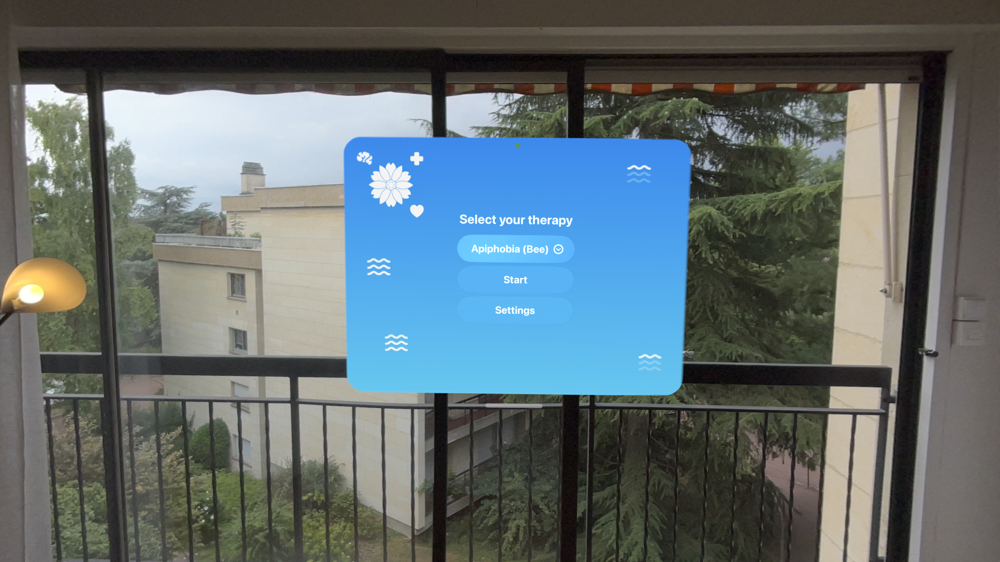
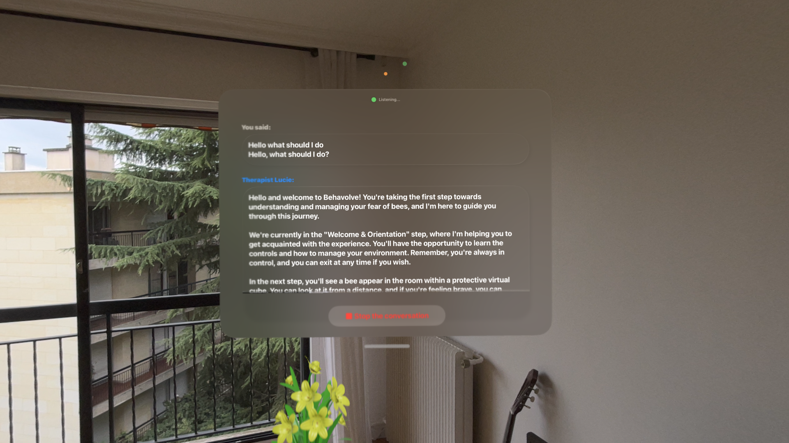
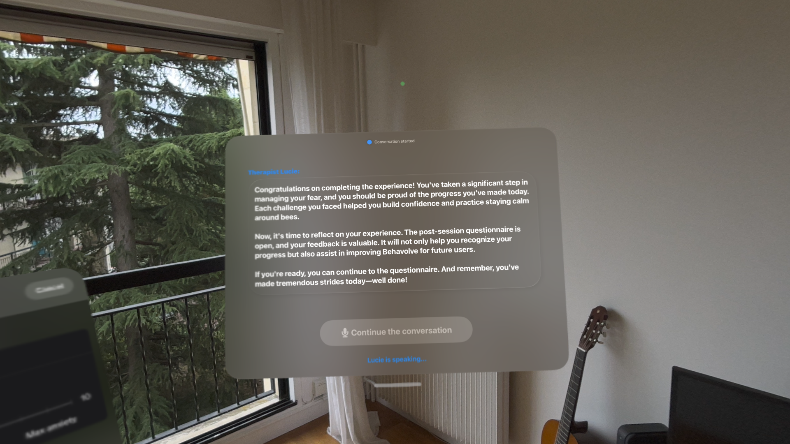
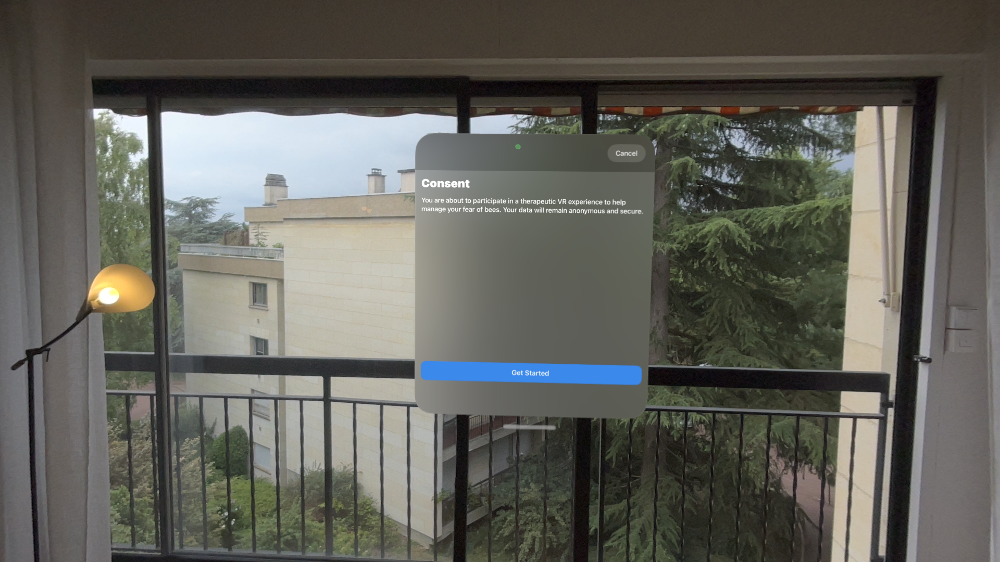

# Summary

**Behavolve - Cognitive Behavioral Therapy in Mixed Reality**

Behavolve is an innovative open-source application dedicated to Cognitive Behavioral Therapy (CBT) in mixed reality (XR). It helps overcome phobias through immersive simulations (bees, snakes, heights, blood draws...) guided by an AI avatar. Developed with Xcode, RealityKit, and Swift, it is designed to leverage the advanced capabilities of the Apple Vision Pro.

# Application Description

Behavolve aims to help individuals overcome their specific phobias and fears by exposing them to realistic virtual simulations in a safe and controlled environment. The application offers a series of immersive scenarios adapted to different phobias, including:

Initially:

- **Fear of Bees**: Start by interacting with virtual bee entities in your own living room or a natural environment to alleviate apiphobia.

Subsequently (if time permits):

- **Fear of Snake**: Explore a virtual forest with a snake to confront ophidiophobia.
- **Fear of Heights**: Experience high-altitude situations to manage acrophobia.
- **Fear of the Sea**: Dive into marine environments to overcome thalassophobia.
- **Blood Draws**: Simulate a blood draw with haptic feedback equipment, like a cuff, to reduce hemophobia.

# Key Features

- **Immersive Environments**: Realistic graphics and spatialized sounds for total immersion. In your own environment (e.g., living room - augmented reality) or in a completely virtual environment (e.g., forest - virtual reality).
- **Personalized Progression**: Adjust the level of exposure based on your comfort and progress.
- **AI Assistance**: An intelligent avatar to guide you, provide relaxation techniques, and explain the theoretical principles of CBT and the best behaviors to adopt in various situations. The avatar also helps define the behavior of an entity (e.g., bee) and its reactions.
- **Apple Vision Pro Compatibility**: Leverages the advanced features of the headset (mixed reality, hand tracking, spatialized sounds…) for an enriching experience.

# Development Plan

- **First Year - Functional Prototype**:
  - Focus on the fear of bees.
  - Development of basic mechanisms and initial simulations.
  - User testing and feedback collection to improve the application.

- **Second Year - Extension of Features**:
  - Improvement of the bee scene.
  - If time permits:
    - Addition of new scenarios: jungle with snakes, spiders, fear of heights, fear of the sea, blood draws.
    - Integration of haptic feedback equipment to enrich the sensory experience.
    - Enhancement of AI assistance for more personalized support.

# Installation

To install this app on your device, follow these steps:

- Download the app:
    - Directly from the App Store (when it will be published).
    - In "Settings" from the App set your OpenAI key.
- Alternative: Download the source project from the main branch:
    - Then open the project with Xcode, hit build, and wait.
    - Optional: You can set your OpenAI key either from the "Settings" in App or by adding your key into AppState.swift.

# Screenshots & Videos

## Screenshots

      
    

## Demo Video

# Documentation

Comprehensive documentation will be provided to:

- Explain the theoretical concepts of CBT.
- Guide users through the application's features.
- Offer advice on the optimal use of Behavolve as a complement to professional therapeutic follow-up.

# Objective of Behavolve

Behavolve aspires to revolutionize the way phobias are addressed by offering an accessible and interactive solution. By combining the power of mixed reality with the proven principles of cognitive behavioral therapy, the application aims to facilitate the healing process and improve the quality of life for users.

# Bonus

The AI-connected avatar not only guides the user but interacts dynamically to:

- Respond to questions in real-time.
- Provide emotional support and encouragement.
- Adapt scenarios based on the user's reactions and comfort level.

# Conclusion

Behavolve represents a fusion between cutting-edge technology and modern therapeutic approaches, opening new perspectives in the treatment of phobias. Thanks to its open-source nature, the community of developers and healthcare professionals can use the application for free and contribute to its continuous enrichment, thus ensuring maximum effectiveness for patients.

**GitHub Link**: [https://github.com/michael-attal/Behavolve](https://github.com/michael-attal/Behavolve)  
**GitHub Project Link**: [https://github.com/users/michael-attal/projects/6](https://github.com/users/michael-attal/projects/6)  
**Presentation Google Slide Link**: [https://docs.google.com/presentation/d/1CGiQbjijKd7yIXRs-GhvPTTEQh7y93ZpbOmSY4KB3yo/edit?usp=sharing](https://docs.google.com/presentation/d/1CGiQbjijKd7yIXRs-GhvPTTEQh7y93ZpbOmSY4KB3yo/edit?usp=sharing)
